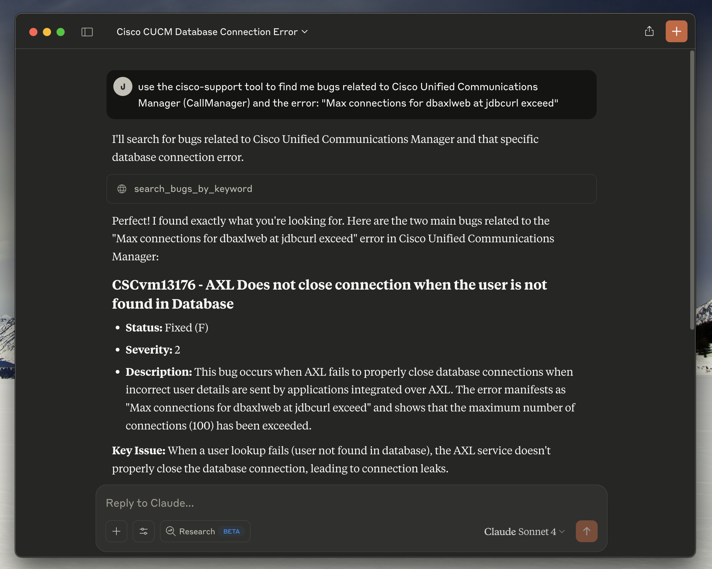
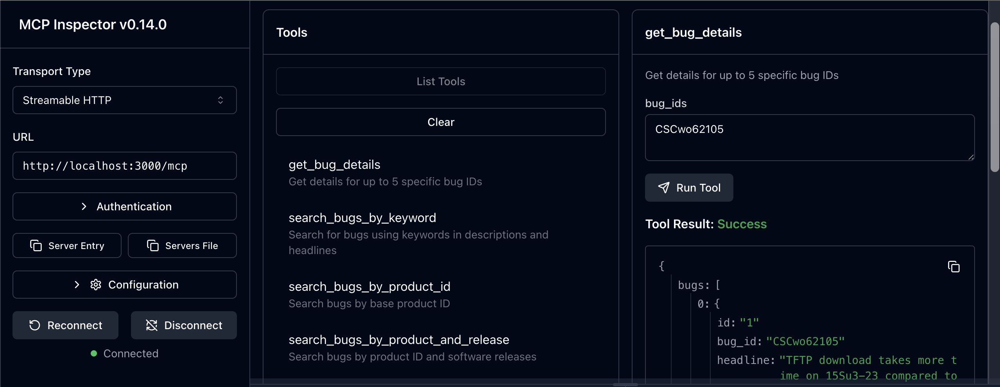

# Cisco Support MCP Server

A production-ready TypeScript MCP (Model Context Protocol) server for Cisco Support APIs with comprehensive security and dual transport support. This extensible server provides access to multiple Cisco Support APIs including Bug Search, Case Management, and End-of-Life information.

## 🚀 Current Features

- **Multi-API Support**: Bug, Case, and EoX APIs fully implemented (16 total tools)
- **Bearer Token Authentication**: MCP Inspector-style security for HTTP endpoints  
- **Configurable API Access**: Enable only the Cisco Support APIs you have access to
- **Specialized Prompts**: 9 workflow prompts for guided Cisco support scenarios
- **Dual Transport**: stdio (local MCP clients) and HTTP (remote server with auth)
- **OAuth2 Authentication**: Automatic token management with Cisco API
- **Real-time Updates**: Server-Sent Events for HTTP mode
- **TypeScript**: Full type safety and MCP SDK integration
- **Production Security**: Helmet, CORS, input validation, Bearer tokens
- **Docker Support**: Containerized deployment with health checks
- **Comprehensive Logging**: Structured logging with timestamps

## 📊 Supported Cisco APIs

The server supports the following Cisco Support APIs (configurable via `SUPPORT_API` environment variable):

| API | Status | Tools | Description |
|-----|--------|-------|-------------|
| **Bug** (`bug`) | ✅ **Complete** | 8 tools | Bug Search, Details, Product-specific searches |
| **Case** (`case`) | ✅ **Complete** | 4 tools | Support case management and operations |
| **EoX** (`eox`) | ✅ **Complete** | 4 tools | End of Life/Sale information and lifecycle planning |
| **PSIRT** (`psirt`) | ✅ **Complete** | 8 tools | Product Security Incident Response Team vulnerability data |
| **Product** (`product`) | ✅ **Complete** | 3 tools | Product details, specifications, and technical information |
| **Software** (`software`) | ✅ **Complete** | 6 tools | Software suggestions, releases, and upgrade recommendations |
| **Serial** (`serial`) | 🔄 *Planned* | 0 tools | Serial number to product information mapping |
| **RMA** (`rma`) | 🔄 *Planned* | 0 tools | Return Merchandise Authorization processes |

**Configuration Examples:**
- `SUPPORT_API=bug` - Bug API only
- `SUPPORT_API=bug,case,eox` - All implemented APIs (recommended)
- `SUPPORT_API=all` - All available APIs (includes placeholders)

## Quick Start

### NPX Installation (Recommended)

**Start in stdio mode for Claude Desktop:**
```bash
npx mcp-cisco-support
```

**Start HTTP server with authentication:**
```bash
npx mcp-cisco-support --http
# Token displayed in console for authentication
```

**Generate Bearer token for HTTP mode:**
```bash
npx mcp-cisco-support --generate-token
```

**Get help and see all options:**
```bash
npx mcp-cisco-support --help
```

### Environment Setup

1. **Generate authentication token (for HTTP mode):**
   ```bash
   npx mcp-cisco-support --generate-token
   export MCP_BEARER_TOKEN=<generated_token>
   ```

2. **Set Cisco API credentials:**
   ```bash
   export CISCO_CLIENT_ID=your_client_id_here
   export CISCO_CLIENT_SECRET=your_client_secret_here
   export SUPPORT_API=bug,case,eox  # Enable multiple APIs
   ```

3. **Start the server:**
   ```bash
   # For Claude Desktop (stdio mode)
   npx mcp-cisco-support
   
   # For HTTP access (with authentication)
   npx mcp-cisco-support --http
   ```

### Local Development
```bash
git clone https://github.com/sieteunoseis/mcp-cisco-support.git
cd mcp-cisco-support
npm install
npm run build
npm start
```

## Claude Desktop Integration

### Prerequisites

1. **Get Cisco API Credentials**:
   - Visit [Cisco API Console](https://apiconsole.cisco.com/)
   - Create an application and get your Client ID and Secret
   - Ensure the application has access to the Bug API

2. **Install Claude Desktop**:
   - Download from [Claude.ai](https://claude.ai/download)
   - Make sure you're using a recent version that supports MCP

### Step-by-Step Setup

1. **Locate Claude Desktop Config File**:
   - **macOS**: `~/Library/Application Support/Claude/claude_desktop_config.json`
   - **Windows**: `%APPDATA%\Claude\claude_desktop_config.json`

2. **Create or Edit the Config File**:
   ```json
   {
     "mcpServers": {
       "cisco-support": {
         "command": "npx",
         "args": ["mcp-cisco-support"],
         "env": {
           "CISCO_CLIENT_ID": "your_client_id_here",
           "CISCO_CLIENT_SECRET": "your_client_secret_here",
           "SUPPORT_API": "bug"
         }
       }
     }
   }
   ```
   
   **Optional**: Configure which APIs to enable with `SUPPORT_API`:
   - `"bug"` - Bug API only (default)
   - `"all"` - All available APIs
   - `"bug,case,eox"` - Multiple specific APIs

3. **Replace Your Credentials**:
   - Replace `your_client_id_here` with your actual Cisco Client ID
   - Replace `your_client_secret_here` with your actual Cisco Client Secret

4. **Restart Claude Desktop**:
   - Close Claude Desktop completely
   - Reopen the application
   - The MCP server will be automatically loaded

### Verification

After setup, you should be able to:

1. **Ask Claude about Cisco bugs**:
   ```
   "Search for bugs related to memory leaks in Cisco switches"
   ```

2. **Get specific bug details**:
   ```
   "Get details for Cisco bug CSCab12345"
   ```

3. **Search by product**:
   ```
   "Find bugs affecting Cisco Catalyst 3560 switches"
   ```

### Example Usage in Claude Desktop

Once configured, you can ask Claude questions like:

- **Basic Bug Search**:
  - "Search for recent bugs related to 'crash' in Cisco products"
  - "Find open bugs with severity 1 or 2"
  - "Show me bugs modified in the last 30 days"

- **Product-Specific Searches**:
  - "Find bugs for product ID C9200-24P"
  - "Search for bugs in Cisco Catalyst 9200 Series affecting release 17.5.1"
  - "Show bugs fixed in software release 17.5.2"

- **Bug Details**:
  - "Get full details for bug CSCab12345"
  - "Show me information about bugs CSCab12345,CSCcd67890"

- **Advanced Filtering**:
  - "Find resolved bugs with severity 3 modified after 2023-01-01"
  - "Search for bugs in 'Cisco ASR 9000 Series' sorted by severity"
  - "Can you show me all the cisco bugs in the last 30 days for the product Cisco Unified Communications Manager (CallManager)?" (uses keyword search)
  - "Find bugs for Cisco Unified Communications Manager affecting releases 14.0 and 15.0" (uses product series search)

Claude will use the appropriate MCP tools to fetch real-time data from Cisco's Bug API and provide comprehensive responses with the latest information.

## MCP Prompts (v1.4.0+)

The server includes 5 specialized **MCP prompts** that provide guided workflows for common Cisco support scenarios. These prompts generate structured investigation plans that help you use the bug search tools more effectively.

### Available Prompts

#### 1. **cisco-incident-investigation**
*Investigate Cisco bugs related to specific incident symptoms and errors*

**Required Arguments:**
- `symptom` - The error message, symptom, or behavior observed
- `product` - Cisco product experiencing the issue

**Optional Arguments:**
- `severity` - Incident severity level (1=Critical, 2=High, 3=Medium)
- `software_version` - Current software version if known

**Example Usage:**
```
Use the cisco-incident-investigation prompt with symptom "device crashes randomly", product "Cisco ASR 1000", and severity "1"
```

#### 2. **cisco-upgrade-planning**
*Research known issues and bugs before upgrading Cisco software or hardware*

**Required Arguments:**
- `current_version` - Current software version (e.g., "15.2(4)S")
- `target_version` - Target upgrade version (e.g., "15.2(4)S5")
- `product` - Cisco product being upgraded

**Optional Arguments:**
- `environment` - Environment type (production, staging, lab)

**Example Usage:**
```
Use the cisco-upgrade-planning prompt for upgrading from version "15.2(4)S" to "15.2(4)S5" on "Cisco ASR 9000" in "production"
```

#### 3. **cisco-maintenance-prep**
*Prepare for maintenance windows by identifying potential issues and bugs*

**Required Arguments:**
- `maintenance_type` - Type of maintenance (software upgrade, hardware replacement, configuration change)
- `product` - Cisco product undergoing maintenance

**Optional Arguments:**
- `software_version` - Current or target software version
- `timeline` - Maintenance window timeline

**Example Usage:**
```
Use the cisco-maintenance-prep prompt for "software upgrade" maintenance on "Cisco Catalyst 9000" with timeline "next week"
```

#### 4. **cisco-security-advisory**
*Research security-related bugs and vulnerabilities for Cisco products*

**Required Arguments:**
- `product` - Cisco product to check for security issues

**Optional Arguments:**
- `software_version` - Software version to check
- `security_focus` - Specific security concern (CVE, vulnerability type, etc.)

**Example Usage:**
```
Use the cisco-security-advisory prompt for product "Cisco IOS XE" with security_focus "authentication bypass"
```

#### 5. **cisco-known-issues**
*Check for known issues in specific Cisco software releases or products*

**Required Arguments:**
- `product` - Cisco product to check
- `software_version` - Specific software version or range

**Optional Arguments:**
- `issue_type` - Type of issues to focus on (performance, stability, features)

**Example Usage:**
```
Use the cisco-known-issues prompt for product "Cisco ASR 1000" version "16.12.04" with issue_type "performance"
```

### How Prompts Work

1. **Prompt Selection**: Choose the appropriate prompt for your scenario
2. **Argument Input**: Provide required and optional arguments
3. **Guided Workflow**: Receive a structured investigation plan
4. **Tool Execution**: Follow the plan to systematically search for bugs
5. **Expert Analysis**: Get recommendations based on findings

### Benefits of Using Prompts

- **Structured Approach**: Follow expert-designed workflows for consistent results
- **Best Practices**: Incorporate years of Cisco support experience
- **Faster Resolution**: Reduce investigation time with targeted searches
- **Knowledge Transfer**: Learn effective troubleshooting methodologies
- **Comprehensive Coverage**: Ensure all relevant angles are investigated

## Screenshots

### Claude Desktop Integration


*Claude Desktop successfully connected to the Cisco Support MCP server, demonstrating the bug search functionality with real-time responses from Cisco's Bug API.*

### MCP Inspector


*MCP Inspector v0.14.0+ showing the available tools and server connectivity testing capabilities.*

### Alternative Installation Methods

#### Global Installation
If you prefer to install globally instead of using npx:

```bash
npm install -g mcp-cisco-support
```

Then use this config:
```json
{
  "mcpServers": {
    "cisco-support": {
      "command": "mcp-cisco-support",
      "env": {
        "CISCO_CLIENT_ID": "your_client_id_here",
        "CISCO_CLIENT_SECRET": "your_client_secret_here",
        "SUPPORT_API": "bug"
      }
    }
  }
}
```

#### Local Installation
For development or custom setups:

```bash
git clone https://github.com/sieteunoseis/mcp-cisco-support.git
cd mcp-cisco-support
npm install
npm run build
```

Then use this config:
```json
{
  "mcpServers": {
    "cisco-support": {
      "command": "node",
      "args": ["/path/to/mcp-cisco-support/dist/index.js"],
      "env": {
        "CISCO_CLIENT_ID": "your_client_id_here",
        "CISCO_CLIENT_SECRET": "your_client_secret_here",
        "SUPPORT_API": "bug"
      }
    }
  }
}
```

### Troubleshooting

#### Common Issues

1. **"Command not found" errors**:
   - Ensure Node.js 18+ is installed
   - Try global installation: `npm install -g mcp-cisco-support`
   - Verify the path in your config file

2. **Authentication failures**:
   - Double-check your Client ID and Secret
   - Ensure your Cisco API app has Bug API access
   - Check for typos in the config file

3. **MCP server not loading**:
   - Restart Claude Desktop completely
   - Check the config file syntax with a JSON validator
   - Look for Claude Desktop logs/error messages

4. **Permission errors**:
   - Ensure the config file is readable
   - On macOS/Linux, check file permissions: `chmod 644 claude_desktop_config.json`

#### Debugging

1. **Test the server manually**:
   ```bash
   npx mcp-cisco-support
   ```
   This should start the server in stdio mode without errors.

2. **Validate your config**:
   Use a JSON validator to ensure your config file is properly formatted.

3. **Check Claude Desktop logs**:
   - Look for MCP-related error messages in Claude Desktop
   - The app usually shows connection status for MCP servers
   
   **Monitor logs in real-time (macOS)**:
   ```bash
   # Follow logs in real-time
   tail -n 20 -F ~/Library/Logs/Claude/mcp*.log
   ```
   
   **On Windows**:
   ```cmd
   # Check logs directory
   %APPDATA%\Claude\logs\
   ```

#### Getting Help

- **Issues**: [GitHub Issues](https://github.com/sieteunoseis/mcp-cisco-support/issues)
- **Cisco API**: [Cisco Developer Documentation](https://developer.cisco.com/docs/support-apis/)
- **MCP Protocol**: [Model Context Protocol](https://modelcontextprotocol.io/)

### Docker Deployment

```bash
# Use pre-built image
docker pull ghcr.io/sieteunoseis/mcp-cisco-support:latest
docker run -p 3000:3000 \
  -e CISCO_CLIENT_ID=your_id \
  -e CISCO_CLIENT_SECRET=your_secret \
  -e SUPPORT_API=bug \
  ghcr.io/sieteunoseis/mcp-cisco-support:latest --http

# Or build locally
docker-compose up -d
```

## 🔐 Security and Authentication

### stdio Mode (Default)
- **No authentication required** - Direct MCP client connection
- **Use case**: Claude Desktop, local MCP clients
- **Security**: Inherits security from the host MCP client

### HTTP Mode (--http)
- **Bearer Token Authentication** - Required for all HTTP endpoints
- **Use case**: Remote access, web applications, API integration
- **Security**: Token-based authentication with secure headers

#### Bearer Token Management

**Generate a new token:**
```bash
npx mcp-cisco-support --generate-token
```

**Use a custom token:**
```bash
export MCP_BEARER_TOKEN=your_custom_token_here
npx mcp-cisco-support --http
```

**Add to .env file:**
```bash
# Custom Bearer token for HTTP authentication
MCP_BEARER_TOKEN=your_custom_secure_token_here
```

**Disable authentication (⚠️ NOT RECOMMENDED for production):**
```bash
export DANGEROUSLY_OMIT_AUTH=true
npx mcp-cisco-support --http
```

#### Authentication Examples

**With Bearer header (recommended):**
```bash
curl -H "Authorization: Bearer your_token_here" \
     -X POST http://localhost:3000/mcp \
     -H "Content-Type: application/json" \
     -d '{"jsonrpc":"2.0","method":"ping","id":1}'
```

**With query parameter (fallback):**
```bash
curl -X POST "http://localhost:3000/mcp?token=your_token_here" \
     -H "Content-Type: application/json" \
     -d '{"jsonrpc":"2.0","method":"ping","id":1}'
```

### Security Best Practices

1. **Use strong tokens** - Generate random tokens via `--generate-token`
2. **Secure storage** - Store tokens in environment variables or `.env` files
3. **Network security** - Use HTTPS in production deployments
4. **Token rotation** - Regularly generate new tokens
5. **Access control** - Only expose HTTP mode to trusted networks

## Configuration

### Environment Variables

Create a `.env` file with your configuration:

```bash
# 🔑 Cisco API OAuth2 Configuration (REQUIRED)
CISCO_CLIENT_ID=your_client_id_here
CISCO_CLIENT_SECRET=your_client_secret_here

# 🌐 Server Configuration
PORT=3000
NODE_ENV=development

# 🚀 API Support Configuration
# Enable specific Cisco Support APIs you have access to
# Options: bug, case, eox (plus planned: product, serial, rma, software, asd)
SUPPORT_API=bug,case,eox              # Multiple APIs
# SUPPORT_API=all                     # All available APIs  
# SUPPORT_API=bug                     # Single API (default)

# 🔐 HTTP Authentication Configuration (HTTP mode only)
# Custom Bearer token for HTTP authentication (optional - generates random if not set)
MCP_BEARER_TOKEN=your_custom_secure_token_here

# ⚠️ SECURITY WARNING: Only use in development/testing
# DANGEROUSLY_OMIT_AUTH=true          # Disables HTTP authentication entirely
```

### Claude Desktop Integration

**Complete configuration for Claude Desktop:**
```json
{
  "mcpServers": {
    "cisco-support": {
      "command": "npx",
      "args": ["mcp-cisco-support"],
      "env": {
        "CISCO_CLIENT_ID": "your_client_id_here",
        "CISCO_CLIENT_SECRET": "your_client_secret_here",
        "SUPPORT_API": "bug,case,eox"
      }
    }
  }
}
```

### Docker Configuration

**With authentication:**
```bash
docker run -p 3000:3000 \
  -e CISCO_CLIENT_ID=your_client_id \
  -e CISCO_CLIENT_SECRET=your_client_secret \
  -e SUPPORT_API=bug,case,eox \
  -e MCP_BEARER_TOKEN=your_secure_token \
  ghcr.io/sieteunoseis/mcp-cisco-support:latest --http
```

**Without authentication (development only):**
```bash
docker run -p 3000:3000 \
  -e CISCO_CLIENT_ID=your_client_id \
  -e CISCO_CLIENT_SECRET=your_client_secret \
  -e DANGEROUSLY_OMIT_AUTH=true \
  ghcr.io/sieteunoseis/mcp-cisco-support:latest --http
```

## API Endpoints

| Endpoint | Method | Description |
|----------|--------|-------------|
| `/` | GET | Server information and available endpoints |
| `/mcp` | POST | Main MCP endpoint (JSON-RPC over HTTP) |
| `/messages` | POST | Alternative MCP endpoint for N8N compatibility |
| `/sse` | GET | SSE connection with session management |
| `/sse` | POST | Legacy SSE message endpoint (deprecated) |
| `/sse/session/{sessionId}` | POST | Session-specific MCP message endpoint |
| `/ping` | GET | Simple ping endpoint for connectivity testing |
| `/health` | GET | Health check with detailed status |

## MCP Tools

### 1. get_bug_details
Get details for up to 5 specific bug IDs.

```json
{
  "jsonrpc": "2.0",
  "id": "1",
  "method": "tools/call",
  "params": {
    "name": "get_bug_details",
    "arguments": {
      "bug_ids": "CSCab12345,CSCcd67890"
    }
  }
}
```

### 2. search_bugs_by_keyword
Search bugs by keywords in descriptions and headlines.

```json
{
  "jsonrpc": "2.0",
  "id": "2",
  "method": "tools/call",
  "params": {
    "name": "search_bugs_by_keyword",
    "arguments": {
      "keyword": "memory leak",
      "page_index": 1,
      "status": "open",
      "severity": "2"
    }
  }
}
```

### 3. search_bugs_by_product_id
Search bugs by base product ID.

```json
{
  "jsonrpc": "2.0",
  "id": "3",
  "method": "tools/call",
  "params": {
    "name": "search_bugs_by_product_id",
    "arguments": {
      "base_pid": "C9200-24P"
    }
  }
}
```

### 4. search_bugs_by_product_and_release
Search bugs by product ID and software releases.

```json
{
  "jsonrpc": "2.0",
  "id": "4",
  "method": "tools/call",
  "params": {
    "name": "search_bugs_by_product_and_release",
    "arguments": {
      "base_pid": "C9200-24P",
      "software_releases": "17.5.1,17.5.2"
    }
  }
}
```

### 5. search_bugs_by_product_series_affected
Search bugs by product series and affected releases.

```json
{
  "jsonrpc": "2.0",
  "id": "5",
  "method": "tools/call",
  "params": {
    "name": "search_bugs_by_product_series_affected",
    "arguments": {
      "product_series": "Cisco Catalyst 9200 Series Switches",
      "affected_releases": "17.5.1"
    }
  }
}
```

### 6. search_bugs_by_product_series_fixed
Search bugs by product series and fixed releases.

```json
{
  "jsonrpc": "2.0",
  "id": "6",
  "method": "tools/call",
  "params": {
    "name": "search_bugs_by_product_series_fixed",
    "arguments": {
      "product_series": "Cisco Catalyst 9200 Series Switches",
      "fixed_releases": "17.5.2"
    }
  }
}
```

### 7. search_bugs_by_product_name_affected
Search bugs by exact product name and affected releases.

```json
{
  "jsonrpc": "2.0",
  "id": "7",
  "method": "tools/call",
  "params": {
    "name": "search_bugs_by_product_name_affected",
    "arguments": {
      "product_name": "Cisco Catalyst 3560-48PS Switch",
      "affected_releases": "17.5.1"
    }
  }
}
```

### 8. search_bugs_by_product_name_fixed
Search bugs by exact product name and fixed releases.

```json
{
  "jsonrpc": "2.0",
  "id": "8",
  "method": "tools/call",
  "params": {
    "name": "search_bugs_by_product_name_fixed",
    "arguments": {
      "product_name": "Cisco Catalyst 3560-48PS Switch",
      "fixed_releases": "17.5.2"
    }
  }
}
```

## Common Parameters

All search tools support these optional parameters:

- `page_index`: Page number (10 results per page, default: 1)
- `status`: Bug status filter (`open`, `resolved`, `closed`)
- `severity`: Bug severity filter (`1`, `2`, `3`, `4`, `5`, `6`)
- `modified_date`: Date filter (`2023-01-01` or range `2023-01-01..2023-12-31`)
- `sort_by`: Sort order (`modified_date`, `bug_id`, `severity`)

## Server-Sent Events

### MCP over SSE Protocol

The server implements proper MCP (Model Context Protocol) over SSE with session management:

#### 1. Connect to SSE Endpoint
```javascript
const eventSource = new EventSource('http://localhost:3000/sse');
```

#### 2. Handle Endpoint Event
On connection, the server sends an `endpoint` event with session information:

```javascript
eventSource.addEventListener('endpoint', (event) => {
  const data = JSON.parse(event.data);
  console.log('Session info:', data);
  // Example: { sessionId: "abc123", endpoint: "/sse/session/abc123", timestamp: "..." }
  
  // Store the session endpoint for making requests
  window.sessionEndpoint = data.endpoint;
});
```

#### 3. Send MCP Messages
Use the session-specific endpoint to send JSON-RPC messages:

```javascript
async function listTools() {
  const response = await fetch(`http://localhost:3000${window.sessionEndpoint}`, {
    method: 'POST',
    headers: { 'Content-Type': 'application/json' },
    body: JSON.stringify({
      jsonrpc: '2.0',
      id: 1,
      method: 'tools/list'
    })
  });
  return response.json();
}

async function callTool(toolName, args) {
  const response = await fetch(`http://localhost:3000${window.sessionEndpoint}`, {
    method: 'POST',
    headers: { 'Content-Type': 'application/json' },
    body: JSON.stringify({
      jsonrpc: '2.0',
      id: 2,
      method: 'tools/call',
      params: { name: toolName, arguments: args }
    })
  });
  return response.json();
}
```

#### 4. Handle Real-time Events
Listen for real-time updates during tool execution:

```javascript
eventSource.addEventListener('tool_start', (event) => {
  const data = JSON.parse(event.data);
  console.log('Tool execution started:', data);
});

eventSource.addEventListener('tool_complete', (event) => {
  const data = JSON.parse(event.data);
  console.log('Tool execution completed:', data);
});

eventSource.addEventListener('tool_error', (event) => {
  const data = JSON.parse(event.data);
  console.log('Tool execution failed:', data);
});

eventSource.addEventListener('message', (event) => {
  const data = JSON.parse(event.data);
  console.log('MCP response:', data);
});

eventSource.addEventListener('ping', (event) => {
  const data = JSON.parse(event.data);
  console.log('Heartbeat:', data);
});
```

### Legacy SSE Support

For backward compatibility, the server also supports direct POST to `/sse`:

```javascript
// Legacy approach (deprecated)
const response = await fetch('http://localhost:3000/sse', {
  method: 'POST',
  headers: { 'Content-Type': 'application/json' },
  body: JSON.stringify({
    jsonrpc: '2.0',
    id: 1,
    method: 'tools/list'
  })
});
```

### N8N Integration

For N8N's MCP client tool, use the SSE endpoint:
- **URL**: `http://localhost:3000/sse`
- **Transport Type**: SSE
- The server automatically handles session management and provides proper MCP protocol support.

## Usage Examples

### cURL Examples

```bash
# Test server connectivity
curl http://localhost:3000/ping

# Check health status
curl http://localhost:3000/health

# List available tools (main MCP endpoint)
curl -X POST http://localhost:3000/mcp \
  -H "Content-Type: application/json" \
  -d '{
    "jsonrpc": "2.0",
    "id": "1",
    "method": "tools/list"
  }'

# List available tools (alternative endpoint for N8N)
curl -X POST http://localhost:3000/messages \
  -H "Content-Type: application/json" \
  -d '{
    "jsonrpc": "2.0",
    "id": "1",
    "method": "tools/list"
  }'

# Test SSE connection (will show endpoint event)
curl -N http://localhost:3000/sse

# Search for bugs by keyword
curl -X POST http://localhost:3000/mcp \
  -H "Content-Type: application/json" \
  -d '{
    "jsonrpc": "2.0",
    "id": "2",
    "method": "tools/call",
    "params": {
      "name": "search_bugs_by_keyword",
      "arguments": {
        "keyword": "crash",
        "severity": "1",
        "status": "open"
      }
    }
  }'

# Get specific bug details
curl -X POST http://localhost:3000/mcp \
  -H "Content-Type: application/json" \
  -d '{
    "jsonrpc": "2.0",
    "id": "3",
    "method": "tools/call",
    "params": {
      "name": "get_bug_details",
      "arguments": {
        "bug_ids": "CSCab12345"
      }
    }
  }'
```

### JavaScript Client Example

```javascript
async function searchBugs(keyword) {
  const response = await fetch('http://localhost:3000/mcp', {
    method: 'POST',
    headers: {
      'Content-Type': 'application/json',
    },
    body: JSON.stringify({
      jsonrpc: '2.0',
      id: Date.now(),
      method: 'tools/call',
      params: {
        name: 'search_bugs_by_keyword',
        arguments: {
          keyword: keyword,
          page_index: 1,
          status: 'open'
        }
      }
    })
  });
  
  const result = await response.json();
  return result;
}
```

## Health Monitoring

The server provides a comprehensive health check endpoint:

```bash
curl http://localhost:3000/health
```

Response includes:
- Server status
- OAuth2 token status
- Memory usage
- Uptime
- Active SSE connections

## Security Features

- **Helmet**: Security headers
- **CORS**: Cross-origin resource sharing
- **Input Validation**: Schema-based validation
- **Non-root Execution**: Docker security
- **Environment Variables**: Secure credential storage

## Troubleshooting

### Common Issues

1. **OAuth2 Authentication Failed**
   - Verify `CISCO_CLIENT_ID` and `CISCO_CLIENT_SECRET`
   - Check network connectivity to `https://id.cisco.com`

2. **API Calls Failing**
   - Check token validity at `/health`
   - Verify network access to `https://apix.cisco.com`

3. **Docker Issues**
   - Ensure environment variables are set
   - Check Docker logs: `docker-compose logs`

### Logs

Structured JSON logs include:
- Timestamp
- Log level (info, error, warn)
- Message
- Additional context data

## Testing

### Running Tests

```bash
# Run all tests
npm test

# Run tests in watch mode
npm run test:watch

# Run tests with coverage
npm run test:coverage

# Run specific test suite
npx jest tests/auth.test.js
npx jest tests/mcp-tools.test.js
```

### Test Structure

The test suite includes:
- **Authentication Tests** (`tests/auth.test.js`): OAuth2 authentication, token management, error handling
- **MCP Tools Tests** (`tests/mcp-tools.test.js`): All 8 MCP tools, error handling, pagination
- **Setup** (`tests/setup.js`): Test environment configuration

## Recent Test Fixes

The following issues were identified and resolved in the test suite:

### ✅ Fixed Issues

1. **Token Refresh Logic**
   - **Problem**: Token expiry calculation was incorrect in `getValidToken()`
   - **Solution**: Fixed condition to properly check if token is within refresh margin
   - **Impact**: Proper token caching and refresh behavior

2. **Multiple Bug IDs Handling**
   - **Problem**: State leakage between tests causing mock sequence mismatches
   - **Solution**: Implemented `resetServerState()` function for proper cleanup
   - **Impact**: Consistent test results across multiple runs

3. **Search Tools Implementation**
   - **Problem**: Same state management issue affecting keyword search and other tools
   - **Solution**: Proper server state reset between tests
   - **Impact**: All 8 MCP tools now work correctly

4. **Error Handling**
   - **Problem**: API errors and network timeouts not properly converted to MCP error responses
   - **Solution**: Enhanced error handling in `handleMCPMessage()` function
   - **Impact**: Proper error responses for client applications

5. **Authentication Failure Scenarios**
   - **Problem**: Health endpoint returning 200 instead of 503 on auth failures
   - **Solution**: Module cache clearing and proper state isolation
   - **Impact**: Correct health status reporting

6. **Test State Management**
   - **Problem**: Module-level variables persisting between tests
   - **Solution**: Added `resetServerState()` export and proper module cache clearing
   - **Impact**: True test isolation and reliable test results

### Test Configuration

- **Jest**: Using Jest with `--forceExit` flag for main test runs
- **State Reset**: Each test gets a fresh server instance with clean state
- **Mock Management**: Proper fetch mocking with correct sequence handling
- **Test Isolation**: Module cache clearing prevents state leakage

### Key Implementation Details

- **Native fetch**: Uses Node.js native fetch instead of external libraries
- **Token Management**: 12-hour token validity with 30-minute refresh margin
- **Error Handling**: Comprehensive error handling with proper MCP error responses
- **Security**: Helmet security headers, CORS support, input validation
- **Logging**: Structured JSON logging with timestamps

## Development

### Project Structure

```
mcp-cisco-support/
├── src/
│   └── index.ts        # Main TypeScript server implementation
├── dist/               # Compiled JavaScript (generated by build)
├── package.json        # Dependencies and scripts
├── tsconfig.json       # TypeScript configuration
├── .env.example       # Environment variables template
├── .env               # Actual environment variables (create from example)
├── .gitignore         # Git ignore rules
├── Dockerfile         # Docker configuration
├── docker-compose.yml # Docker Compose setup
├── screenshots/        # Documentation screenshots
│   └── mcp-inspector-screenshot.png
├── CLAUDE.md          # Project instructions and architecture
└── README.md          # Project documentation
```

### Development Commands

```bash
# Install dependencies
npm install

# Start development server with auto-reload
npm run dev

# Run tests
npm test

# Run tests in watch mode
npm run test:watch

# Build Docker image
docker build -t mcp-cisco-support .

# View logs in development
npm run dev 2>&1 | jq '.'  # Pretty print JSON logs
```

### Performance Considerations

- Token caching reduces API calls
- Pagination limits results to 10 per page
- SSE heartbeat every 30 seconds keeps connections alive
- Request timeout set to 30 seconds

### Security Notes

- Never commit `.env` file to version control
- Use environment variables for all secrets
- Review Cisco API usage limits and terms
- Monitor logs for suspicious activity

## API Reference

### Authentication

- **OAuth2 URL**: `https://id.cisco.com/oauth2/default/v1/token`
- **Grant Type**: `client_credentials`
- **Token Validity**: 12 hours
- **Auto-refresh**: 30 minutes before expiry

### Bug API Base URL

- **Base URL**: `https://apix.cisco.com/bug/v2.0`

### MCP Protocol

The server implements the Model Context Protocol with these methods:
- `initialize`: Initialize MCP connection
- `tools/list`: List available tools
- `tools/call`: Execute a tool

Example MCP message:
```json
{
  "jsonrpc": "2.0",
  "id": "1",
  "method": "tools/call",
  "params": {
    "name": "search_bugs_by_keyword",
    "arguments": {
      "keyword": "memory leak",
      "status": "open"
    }
  }
}
```

## Troubleshooting

### Common Issues

1. **Authentication Errors**
   - Verify your `CISCO_CLIENT_ID` and `CISCO_CLIENT_SECRET`
   - Check that your credentials have access to the Bug API
   - Review logs for specific OAuth2 error messages

2. **Network Timeouts**
   - Default timeout is 30 seconds
   - Check your network connectivity to Cisco APIs
   - Verify firewall settings allow outbound HTTPS

3. **Test Failures**
   - Run tests individually to isolate issues: `npx jest tests/auth.test.js`
   - Check that environment variables are set correctly in test mode
   - Verify mock setup in test files

4. **SSE Connection Issues**
   - Check that client properly handles event stream format
   - Verify CORS settings if connecting from browser
   - Monitor connection logs for disconnect events

### Debugging

```bash
# Enable debug logging
NODE_ENV=development npm run dev

# Check health status
curl http://localhost:3000/health

# View Docker logs
docker-compose logs -f

# Test specific MCP tool
curl -X POST http://localhost:3000/mcp \
  -H "Content-Type: application/json" \
  -d '{"jsonrpc":"2.0","id":"test","method":"tools/list"}'
```

## Testing Framework

This project includes a comprehensive Jest-based testing framework that validates all functionality without requiring live API calls during development.

### Test Coverage

✅ **Simple Tests**: 3/3 passing - Basic functionality validation  
✅ **Bug API Tests**: 17/17 passing - All 8 Bug API tools fully tested  
✅ **MCP Server Tests**: 11/11 passing - Server functionality and configuration  
✅ **Integration Tests**: 7/7 passing - Real API validation with live credentials  
✅ **Error Handling Tests**: Timeout, authentication, and parameter validation

### Running Tests

```bash
# Run all tests
npm test

# Run specific test suites
npm test -- --testNamePattern="Bug API"
npm test -- --testNamePattern="Simple"
npm test -- --testNamePattern="MCP Server"

# Run integration tests with real API (requires credentials)
CISCO_CLIENT_ID=your_id CISCO_CLIENT_SECRET=your_secret npm test -- --testNamePattern="Integration"

# Run tests with coverage
npm test -- --coverage
```

### Individual Tool Testing

The project includes multiple ways to test individual MCP tools for development and debugging:

#### 1. Standalone Tool Test Runner

Test any tool with both mock and real API modes:

```bash
# Test with mock data (default)
npm run test:tool search_bugs_by_keyword
node test-tool.js search_bugs_by_keyword mock

# Test with real Cisco API
CISCO_CLIENT_ID=your_id CISCO_CLIENT_SECRET=your_secret node test-tool.js search_bugs_by_keyword real

# Test other tools
node test-tool.js get_bug_details
node test-tool.js search_bugs_by_product_id real
```

**Available Tools:**
- `get_bug_details`
- `search_bugs_by_keyword`
- `search_bugs_by_product_id`
- `search_bugs_by_product_and_release`
- `search_bugs_by_product_series_affected`
- `search_bugs_by_product_series_fixed`
- `search_bugs_by_product_name_affected`
- `search_bugs_by_product_name_fixed`

#### 2. Jest-based Tool Testing

Run Jest tests for specific tools:

```bash
# Test a specific tool with Jest
npm run test:jest-tool search_bugs_by_keyword
node scripts/test-specific-tool.js get_bug_details

# This converts tool names to Jest test patterns
# search_bugs_by_keyword becomes "search.*bugs.*by.*keyword"
```

#### 3. Tool Test Output

The standalone tool tester provides detailed output:

```bash
🔧 Testing Tool: search_bugs_by_keyword
📝 Description: Search bugs by keyword with filters
🎯 Mode: 🧪 Mock Mode
📋 Arguments: {
  "keyword": "CallManager",
  "severity": "3",
  "status": "O"
}

⏳ Executing tool...

✅ Success! (15ms)
📊 Result: {
  "bugs": [
    {
      "bug_id": "CSCvi12345",
      "headline": "Test bug for CallManager 12.5 memory leak",
      "status": "O",
      "severity": "3"
    }
  ],
  "total_results": 1
}

📈 Summary:
  • Found 1 bugs
  • First bug: CSCvi12345 - Test bug for CallManager 12.5 memory leak...
```

#### 4. Tool Testing npm Scripts

```bash
# Available npm scripts for tool testing
npm run test:tool              # Build and run tool tester
npm run test:jest-tool         # Jest-based tool testing
npm run test:integration       # Real API integration tests
npm run test:coverage          # Test coverage report
```

### Test Structure

- **`tests/simple.test.ts`** - Basic functionality and tool discovery
- **`tests/bugApi.test.ts`** - Comprehensive Bug API tool testing with mocks
- **`tests/mcpServer.test.ts`** - MCP server functionality and prompt testing
- **`tests/integration.test.ts`** - Real API integration tests (skipped by default)
- **`tests/errorHandling.test.ts`** - Error scenarios and edge cases
- **`tests/mockData.ts`** - Mock Cisco API responses for unit tests
- **`tests/setup.ts`** - Jest configuration and global mocks

### Mock Data and Testing

The test framework uses comprehensive mock data that simulates real Cisco Bug API responses:

```typescript
// Example mock bug response
{
  bugs: [
    {
      bug_id: 'CSCvi12345',
      headline: 'Test bug for CallManager 12.5 memory leak',
      status: 'O',
      severity: '3',
      product: 'Cisco Unified Communications Manager',
      affected_releases: ['12.5(1)SU1', '12.5(1)SU2'],
      fixed_releases: ['12.5(1)SU3']
    }
  ],
  total_results: 1
}
```

### Real API Testing

Integration tests can be run with real Cisco API credentials to validate:

- OAuth2 authentication flow
- Parameter validation with live API
- Error handling with actual API responses
- Rate limiting and network error scenarios

### Key Test Features

- **Fetch Mocking**: Proper Jest mocking for all HTTP requests
- **Parameter Validation**: Tests for all required and optional parameters
- **Error Scenarios**: Comprehensive error handling validation
- **Schema Validation**: JSON Schema compliance for all tools
- **Real vs Mock**: Separate unit tests (mocked) and integration tests (real API)

## API Documentation (WADL)

The project includes official Cisco Bug API v2.0 WADL (Web Application Description Language) specification in the `wadl/` directory:

### WADL File Structure

```
wadl/
└── Cisco-BUG-API-v2_0.wadl    # Complete API specification
```

### Key WADL Insights

The WADL file confirms critical API limitations that were implemented in this server:

1. **Single Value Parameters**: The WADL definitively shows that `severity` and `status` parameters only accept single values, not comma-separated lists:
   ```xml
   <!-- From WADL: Only one severity value allowed -->
   <param name="severity" style="query" type="xs:string"/>
   ```

2. **Parameter Constraints**: Documents valid values for each parameter:
   - **Severity**: 1, 2, 3, 4, 5, 6 (single values only)
   - **Status**: O (Open), F (Fixed), T (Terminated), etc.
   - **Modified Date**: 1, 2, 3, 4, 5 (days/weeks/months)

3. **Endpoint Structure**: Validates the correct URL patterns for all 8 implemented endpoints:
   - `/bugs/bug_ids/{bug_ids}`
   - `/bugs/keyword/{keyword}`
   - `/bugs/products/product_id/{base_pid}`
   - `/bugs/products/product_id/{base_pid}/software_releases/{software_releases}`
   - And more...

### Using WADL for Development

The WADL file serves as the authoritative reference for:
- Parameter validation rules
- Response format specifications
- Error code definitions
- Authentication requirements

This ensures the MCP server implementation matches Cisco's official API specification exactly.

## License

MIT License - see LICENSE file for details.

## Contributing

1. Fork the repository
2. Create a feature branch
3. Make your changes
4. Add tests for new functionality
5. Ensure all tests pass: `npm test`
6. Submit a pull request

## Support

For detailed documentation, see [CLAUDE.md](./CLAUDE.md).

For issues related to:
- **Server**: Create an issue in this repository
- **Cisco API**: Refer to [Cisco Developer Documentation](https://developer.cisco.com/docs/support-apis/)
- **MCP Protocol**: Check the [Model Context Protocol specification](https://modelcontextprotocol.io/)